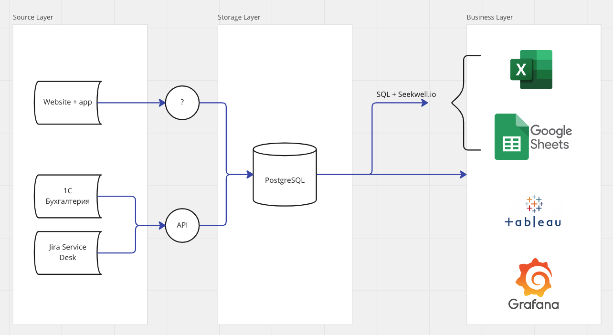
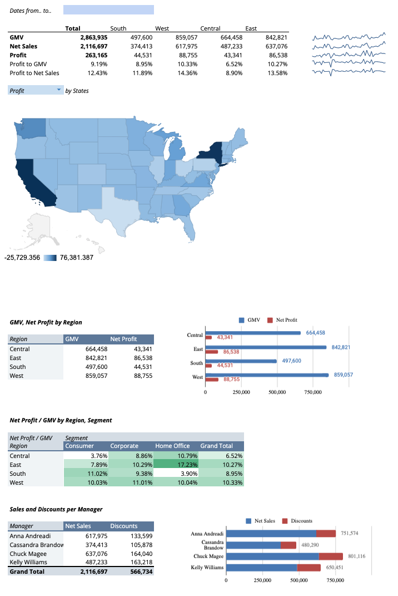

# Модуль 1

## GitHub, создание репозитория и работа с локальной машины

Что было сделано:
1. Установка Git в терминале
2. Прошел первые 3 модуля курса [introduction into Shell](https://app.datacamp.com/learn/courses/introduction-to-shell-for-data-science) (базовые манипуляции в терминале до манипуляций и редактирования файлов - на этом остановился, потому что пока не понимаю зачем мне понадобится редактирование файлов через терминал)
3. Создал репозиторий через web интерфейс. Далее все манипуляции и загрузка данных происходили с локальной машины через terminal:
  - git clone
  - git status / git pull origin main
  - git add .
  - git commit -m ‘added new files’
  - git push

Позднее по мере описания этой страницы, я начал использовать Atom с надстройками Markdown Preview и Git-Plus для редактирования и коммитов.

## Архитектура Аналитического Решения

Пример архитектуры взял из головы - тут понимаю, что знаний того, как устроен Source Layer у меня нет. Самое далекое, чего касался при работе - доступ в Postgres и прямые запросы данных, то есть Business Layer.

Диаграмма нарисована в Miro - мне UX нравится больше, чем draw.io.

## Аналитика в Excel

У меня не установлен MS Excel, поэтому все делал через Google Sheets. Часть функционала обрезана по сравнению с MS Excel, например нет возможности (или я не нашел) установить селекторы/срезы для pivot charts, а также урезанные настройки для графиков. В остальном, функционала Google Sheets достаточно, чтобы сделать базовый дэшборд.

Оригинал лежит [здесь](https://docs.google.com/spreadsheets/d/1atxrtPlPwRZNIWuIy2sJmMBWJQiI2y0LNckrQWh70vQ/edit?usp=sharing).

Получилось выложить дэшборд в виде отдельного [html](https://romankalitenko.github.io/DE101/Module1/DE101_Module1_Lab1.1/DASHBOARD_1.html), но в сети не нашел примеров как можно эту страничку приложить как интерактивную картинку в README, оставил просто ссылкой.

Также [копия XLSX](DE101_Module1_Lab1.1.xlsx) лежит в репозитории, но надо иметь в виду, что при открытии файла через ms excel, форматы могут поехать.

