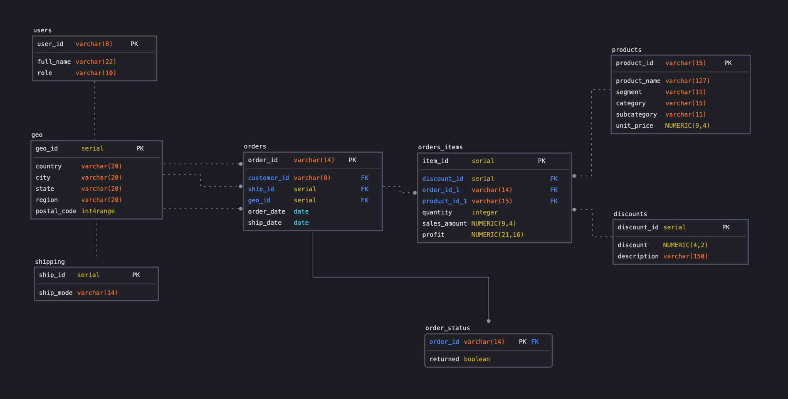

# Модуль 2

## Установка БД

Установил базу PostgreSQL 15.

## Загрузка данных в БД

Данные загружены через запросы DBeaver - использовал готовые скрипты, таблицы [orders](data_upload_sql/orders.sql), [people](data_upload_sql/people.sql), [returns](/data_upload_sql/returns.sql).

В принципе можно было бы сделать это проще (чтобы не писать команды `insert into`):
- Вариант 1 - вкладки из Sample.xls сохранить в CSV. Создать сами таблицы через клиент или командную строку и далее `COPY orders FROM '/path/... orders.csv' DELIMITER ',' CSV HEADER
`
- Вариант 2 - тот же CSV импортировать через функцию `Импорт данных` в DBeaver или PgAdmin

## SQL запросы

1. Суммы продаж по штатам, где кол-во заказов > 10
```
select distinct
	state ,
	count(order_id) as orders,
	sum(sales) as rev
from orders
group by 1
having count(order_id) > 10
order by rev desc;
```

2. Упущенная выгода - сумма возвратов
```
select
	sum(sales)
from orders o
inner join (select distinct order_id from returns) as dr on dr.order_id = o.order_id ;
```

3. Ранжирование сэйлзов
```
select
	p.person as Salesman,
	count(order_id) as Orders,
	sum(sales) as Sales,
	sum(profit) as Profit
from orders o
left join people p on p.region = o.region
group by 1
order by 4 desc
```

## Нарисовать модель данных в SQLdbm



## Нарисовать графики в Google Sheets

## Нарисовать графики в KlipFolio
